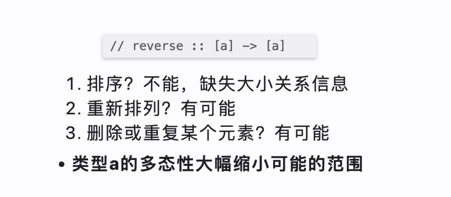
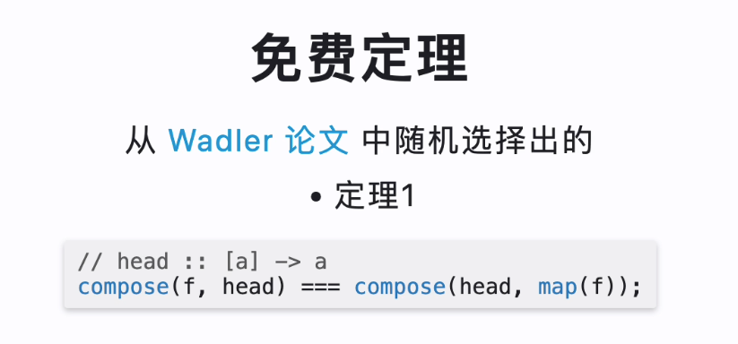
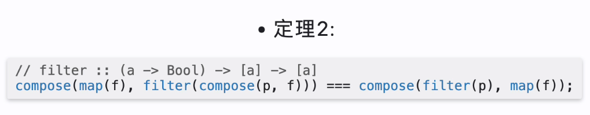
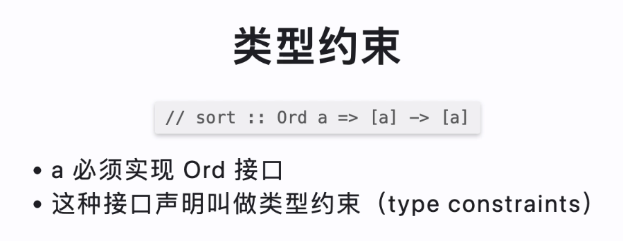

# 函数组合

js 中有 compose()

函数的结合律

## pointfree

pointfree，比方说：

```haskell
addOne = \x -> x + 1
```

这个 lambda 显式的接受一个参数，
下面这个是 pointfree 的版本

```haskell
addOne = (+1)
```

## 幺元

```haskell
id = \x -> x
```

1 乘以 任何数 都是 1

```js
(compose(id, f) === compose(f, id)) === f;
```

## Hindley-Milner 类型签名

```js
// reduce :: ((b, a) -> b) -> b -> [a] -> b
const reduce = curry((f, x, xs) => sx.reduce(f, x));
```

上面的类型签名，可以知道，reduce 是一个函数，`函数 -> b -> [a] -> b`。函数类型签名中的`a, b`其实是来自于后面的`b -> [a] -> b`的。于是其实可以才测出，后面将什么传递给什么。这确实很有趣

## hoogle 类型签名 搜索引擎



## 免费定义

（一些例子）

### 定理 1



尽管这两个式子表示同一个意思，但是左边的要快一些（因为只用对 head 的部分进行 map）

### 定理 2



先过滤，再 map 会快一些。（lazy）

## 类型约束



## container

```js
class Container {
  constructor(x) {
    this.$value = x;
  }

  static of(x) {
    return new Container(x);
  }
}

// (a -> b) -> Container a -> Container b
Container.protype.map = function (f) {
  return Container.of(f(this.$value));
};

console.log(Container.of(2).map((two) => two + 2));
```

这个性质很好，就是我可以不离开 Container。比方说这里的 Container.of(2) 就是一个 Container。
然后我通过 map 传入一个函数`(two) => two + 2`，然后 返回一个新的 Container。

functor 的意思就是：实现了 map 函数，并且遵循一些特定规则的 容器类型。这里的 Container 就是 一个 functor。

让容器自己去运用函数：说的正是`Container.of(2).map( <function> )`。这有什么好处呢？

我们可以实现 Maybe

```js
class Maybe {
  map(fn) {
    return this.isNothing ? this : Maybe.of(fn(this.$value));
  }
}
```

map 可以通过 curry 的方式，来代替任何的 functor

我们可以借助 functor 来实现 map（因为 functor 是实现了 map 的容器）

```cxx
// map :: Functor f => (a -> b) -> f a -> f b
const map = curry((f, anyFunctor) => anyFunctor.map(f));
```

## lift

一个函数在调用的时候，如果被 map 包裹了，
那么他从一个非 functor 函数转换为一个 functor 函数，
我们把这个过程叫做 lift

### 必要时 再 lift

- 普通函数更适合普通的 数据类型 而不是容器类型
- 必要的时候再通过 lift 变为 何时的容器去操作容器类型
- 好处：复用性更好，兼容任何的 functor

## either

either 不只是一个包含错误的容器，他还表示

- 表示逻辑或
- 范畴论中的 coproduct
- 不相交 并集

## IO

```js
class IO {
  static of(x) {
    return new IO(() => x);
  }

  constructor(fn) {
    this.$value = fn;
  }

  map(fn) {
    return new IO(compose(fn, this.$value));
  }

  inspect() {
    return "IO(${inspect(this.$value)})";
  }
}
```
